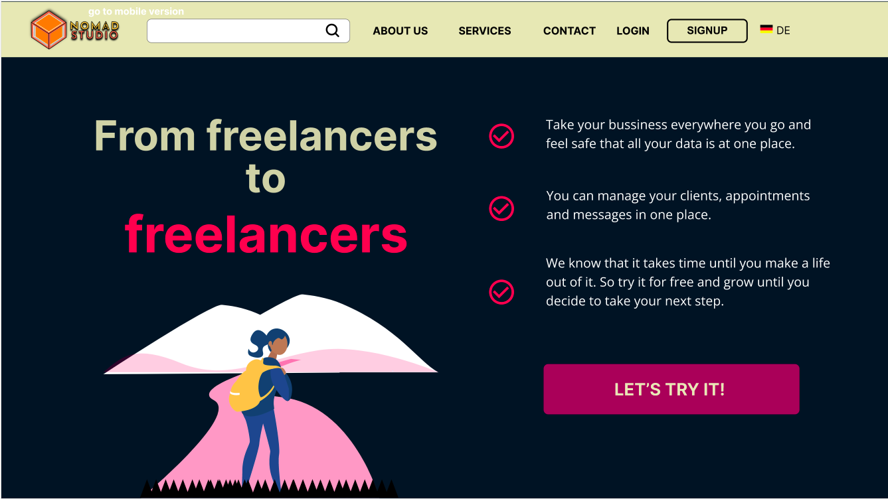
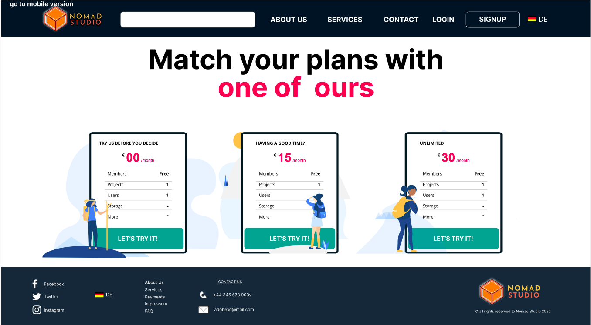
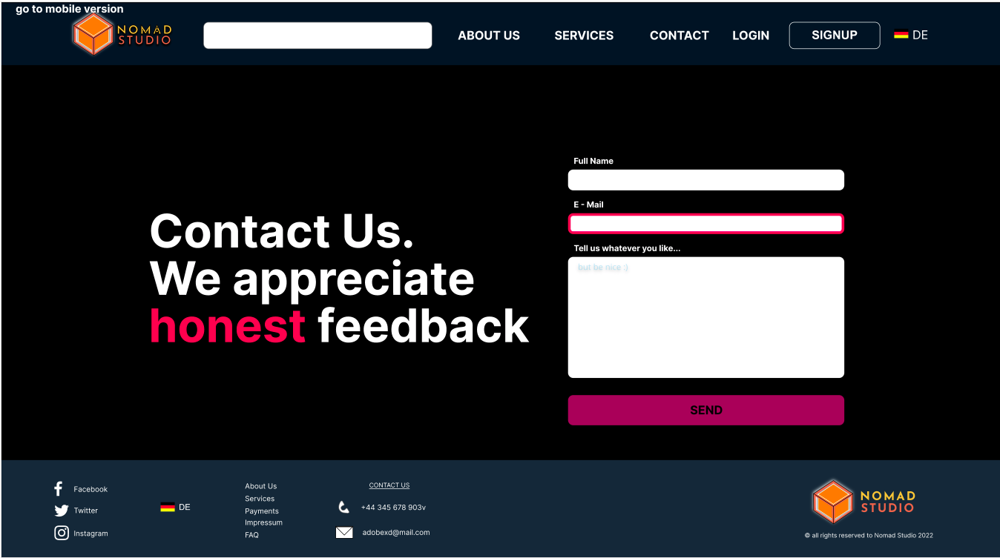
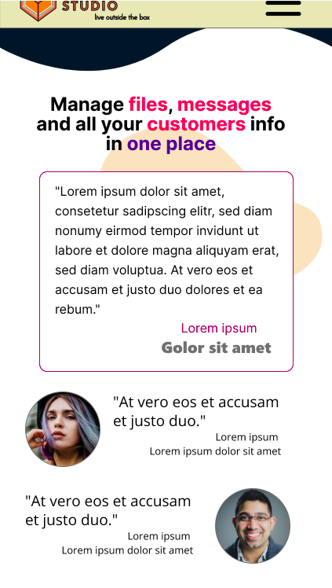

# NOMAD STUDIO

Nomad Studio is a website built from the freelancer to the freelancer. There any freelancer have the possibility to manage contacts, project and share commuincation and information about the project in hand. The userhas the possibility to acces the page temporaly in roder to see the develpement of the product or service which he is paying for.

## Sneak a peak of the project

Here are some images of how this looks like:

